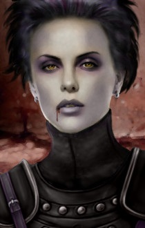

<html>

<b>Valen NPC</b>

<b>NPC mod for BG2EE and EET</b>

Valen (Bodhi's messenger) becomes an NPC who can join your party. 
- She's a Chaotic Evil Vampire fighter/thief. 
- She has quite a bit of interjection dialogue in SoA. 
- She won't get along with Aerie, Anomen, Keldorn or Mazzy.
- Her innate vampiric powers increase with experience. 
- One Valen-specific challenge. 

  
  

 
&nbsp;

&nbsp;

</body>

</html>

